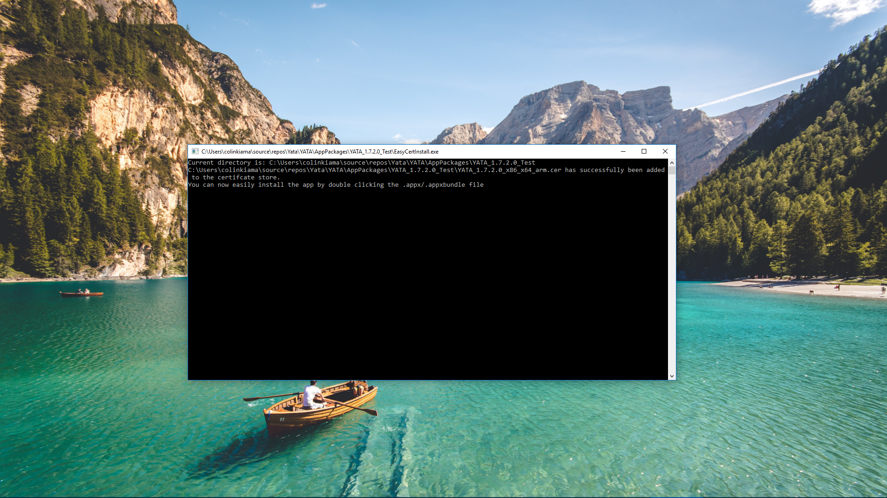

# EasyCertInstall
A C# console program that makes certificate installation easy.

## Where to get the program:
You can get the program from here [EasyCertInstall Releases](https://github.com/colinkiama/EasyCertInstall/releases)

## How to use the program:
Start "EasyCertInstall.exe" in the directory where the certificate you want to install is.

For example, in the directory where an UWP package is located with it's cert and .appx/.appxbundle file. Removes the hassle of getting the user to install the certificate in the correct location.

## Screenshot

